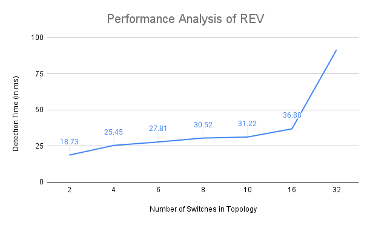

# REV — Rule Enforcement Verification in P4

An independent P4/BMv2 implementation of **REV**, proposed in:

> P. Zhang, H. Wu, D. Zhang and Q. Li, "Verifying rule enforcement in software defined networks with REV," *IEEE/ACM Transactions on Networking*, vol. 28, no. 2, pp. 917–929, 2020.

The algorithm is theirs; this implementation is mine.

It lets an SDN controller verify that the forwarding rules it installed are actually being enforced by the switches, detecting **path deviation** and **unauthorized access** at runtime. The implementation is evaluated across topologies of 2 to 32 switches.

---

## Repository layout

```
rev/
├── s1.p4 … s32.p4         P4 programs, one per switch
├── controller.py          controller: installs rules and verifies enforcement
├── send.py / receive.py   host-side traffic generation and capture
├── keys.json, 32_keys.json
├── topologies/            topo2, topo4, topo6, topo8, topo10, topo16, topo32
├── Makefile
├── disable_ipv6.sh, clean.sh
└── Performance-Analysis-of-REV.png
utils/                     helper scripts from p4lang/tutorials (Apache-2.0, see below)
```

## Requirements

- BMv2 (`simple_switch_grpc`) and Mininet
- P4 compiler (`p4c`) 1.2.4.14
- Python 3 with scapy 2.5.0

A preconfigured VM with the toolchain is available [here](https://drive.google.com/file/d/14DI0Ovnn2eo3boFewWHg83xnhtF1jKjK/view).

## Running

1. Clone the repository and change into `rev/`:
   ```bash
   git clone https://github.com/garg-tech/p4-rev-baseline.git
   cd p4-rev-baseline/rev
   ```
2. Disable IPv6 and start the network (default topology: `topologies/topo4`):
   ```bash
   ./disable_ipv6.sh
   make run TOPO_DIR=topologies/topo4
   ```
3. From the Mininet prompt, open terminals on the first and last hosts, where `n` is the highest-numbered switch in the topology:
   ```
   mininet> xterm h1 hn
   ```
4. In a new terminal, start the controller with the matching topology file:
   ```bash
   sudo python3 controller.py --topo=topologies/topo4/topology.json
   ```
5. In the `hn` terminal, start the receiver:
   ```bash
   python3 receive.py
   ```
6. In the `h1` terminal, send traffic:
   ```bash
   python3 send.py <destination-ip> <message> <number-of-packets>
   ```
7. The controller terminal reports, per packet, whether rule enforcement was verified or a deviation was detected.

To clean up afterwards: `make stop && make clean`.

## Results

Average time for REV to verify rule enforcement, by topology size:

| Switches in topology | Average verification time (ms) |
| -------------------: | -----------------------------: |
| 2                    | 18.73                          |
| 4                    | 25.45                          |
| 6                    | 27.81                          |
| 8                    | 30.52                          |
| 10                   | 31.22                          |
| 16                   | 36.88                          |
| 32                   | 91.43                          |



## Citation

If you use this implementation, please cite the original REV paper:

```bibtex
@article{zhang2020rev,
  author  = {P. Zhang and H. Wu and D. Zhang and Q. Li},
  title   = {Verifying Rule Enforcement in Software Defined Networks with {REV}},
  journal = {IEEE/ACM Transactions on Networking},
  volume  = {28},
  number  = {2},
  pages   = {917--929},
  year    = {2020}
}
```

## License

Code in `rev/` is released under the [MIT License](LICENSE).

The helper scripts in `utils/` are taken from [p4lang/tutorials](https://github.com/p4lang/tutorials), © Barefoot Networks, Inc. and Open Networking Foundation, and remain under the [Apache License 2.0](utils/LICENSE). Their original copyright headers are retained in each file.

## Contact

Devansh Garg — gargdevansh1806@gmail.com
